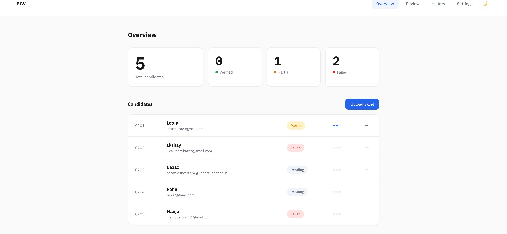
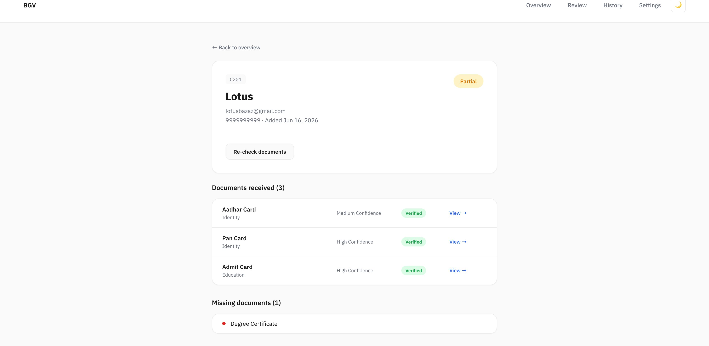
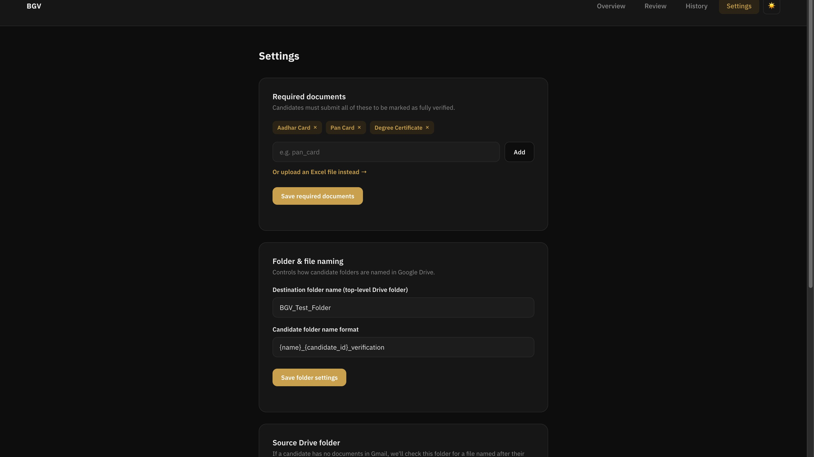
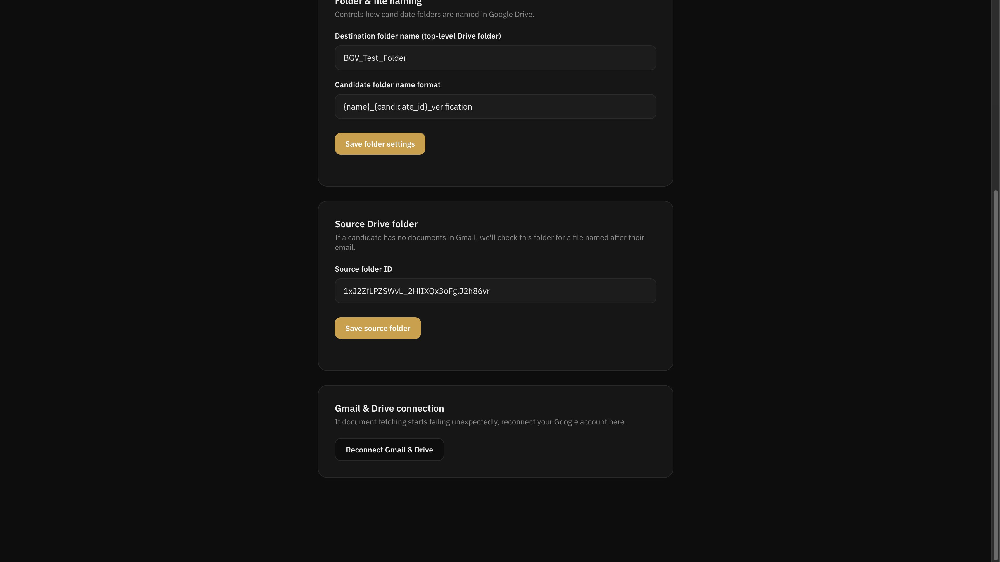
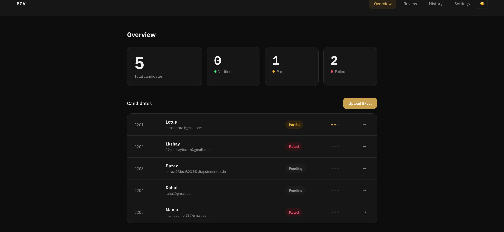
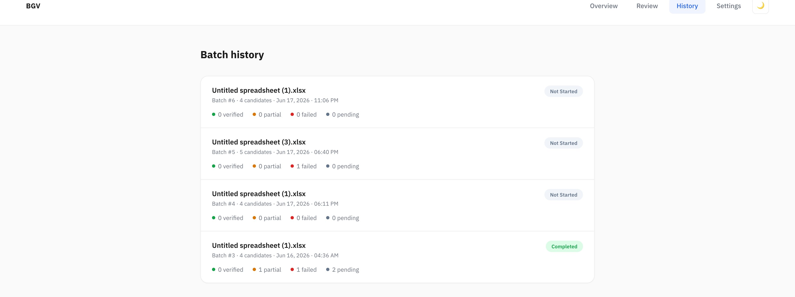

# BGV Automation

HR normally has to dig through every candidate's email, figure out which attachment is which document, save it somewhere organized, and track who's still missing what. Doesn't scale past a handful of people. This does it automatically.

## What it actually does

HR uploads an Excel sheet of candidates and hits process. For each candidate, the app:

1. Searches their email for attachments (falls back to a shared Drive folder if nothing's in Gmail)
2. Splits any multi-document PDFs into individual pages — people love stitching Aadhar front, back, and PAN into one file
3. Extracts real text from each page (or OCR if it's a scanned photo, which most ID docs are)
4. Sends that text to an LLM (Groq, Llama 3.3 70B) and asks it what document this is, with a confidence score
5. Merges same-type consecutive pages back together, uploads to the right folder on Drive, and recalculates the candidate's status




## Why this counts as RAG

The classification step doesn't hardcode "if filename contains 'aadhar' → Aadhar card." It actually pulls the real content out of the PDF (retrieval) and hands that to the model to reason over (generation). Filenames lie, page content doesn't.

## The bug that actually mattered

PyMuPDF pulls text fine from anything typed and exported as PDF — offer letters, that kind of thing. But most real ID docs (Aadhar, PAN) get sent as scanned photos with zero actual text in the PDF. Added Tesseract OCR as a fallback for those.

Then hit a second, sneakier problem: OCR on Aadhar cards was coming out garbled — unreadable enough that the model classified an Aadhar as a passport. Made sense once I looked closer: both have name/DOB/gender, so with junk OCR output the model genuinely couldn't tell them apart (and correctly flagged it as low confidence, at least). Turned out Tesseract defaults to English-only, and Aadhar cards are bilingual Hindi/English. Added the Hindi language pack and the garbling went away.

If the tool can't read a document properly in the first place, nothing it says about that document is trustworthy — so this wasn't a nice-to-have fix.

## Other stuff that broke

- **Combined PDFs silently lost documents.** First version treated every PDF as exactly one document, so a file with Aadhar front + back + PAN stitched together just got classified as whatever the model guessed for the whole thing — the other two documents vanished. Fixed by splitting multi-page PDFs into individual pages, classifying each one separately, then merging consecutive same-type pages back into one file before upload.
- **Batch processing used to just hang.** The API request wouldn't return until every candidate in the batch was done — fine for 5 candidates, useless for 200. Moved it to FastAPI background tasks with a separate status endpoint HR can poll, even after refreshing the page.
- **Resent documents.** Someone sends a blurry Aadhar, then a clearer one later. If the new one classifies with higher confidence than what's on file, it replaces the old one and deletes it from Drive. Otherwise it's treated as a duplicate and skipped.
- **Settings that existed but weren't wired up.** Went back over my own requirements doc partway through and found the folder-naming setting was being saved but never actually used by the upload logic, and there was no manual reconnect flow for expired Google tokens. Re-checking against the original spec instead of just plowing forward caught both.




## Did I actually check it works

Went through the original requirements doc again at the end and confirmed everything's implemented: Google login, the four-number dashboard, scalable Excel upload with validation, Gmail-or-fallback-Drive document retrieval, multi-document PDF splitting, classification against the full document checklist, folder/file naming actually wired into the upload path, status calculated off configurable required documents, a processing view that survives a refresh, batch history, candidate detail pages, a review queue where retry is restricted to failed candidates only, and manual Gmail/Drive reconnect.




## What this can't do

- Classification confidence is only as good as OCR quality — a bad enough scan can still trip it up, it'll just (usually) flag low confidence rather than being silently wrong.
- No line item for documents that don't match any category in the checklist — they just don't get filed anywhere.
- Depends on the Groq API being up; no local fallback model.

## How it's built

- **Backend:** Python, FastAPI, PostgreSQL + SQLAlchemy, Google OAuth 2.0 (Gmail + Drive), PyMuPDF, Tesseract OCR (Hindi + English), Groq API (Llama 3.3 70B)
- **Frontend:** 5 plain HTML/CSS/JS pages, no framework, no build step — Dashboard, Candidate Detail, Review Queue, Batch History, Settings. Shared light/dark theme toggle and toast notifications across all of them.



## Code layout

```
backend/
  main.py                    entry point, wires up routes
  database.py                SQLAlchemy connection/session setup
  models.py                  Batch, Candidate, Document, Settings, User tables
  api/
    auth.py                  Google OAuth flow + manual reconnect
    candidates.py            upload, processing, dashboard, review, history
    settings.py               required docs, folder naming, source folder
  services/
    gmail_service.py         auth'd Gmail client, attachment search/download
    drive_service.py         folder creation, uploads, replace/delete
  agents/
    classifier.py            text extraction (+ OCR), LLM classification, page split/merge
    pipeline.py              the actual end-to-end flow per candidate, and the batch loop

frontend/
  index.html                 dashboard
  candidate.html             candidate detail
  review.html                review queue
  history.html                batch history
  settings.html               settings
```
